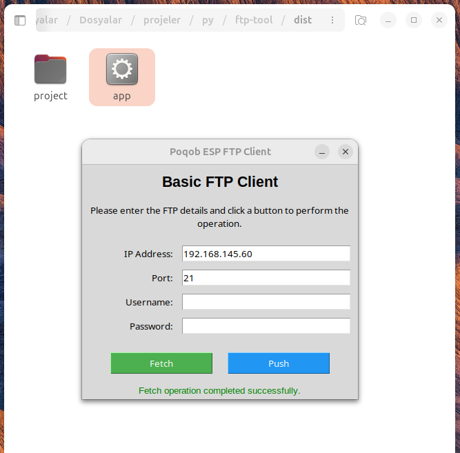
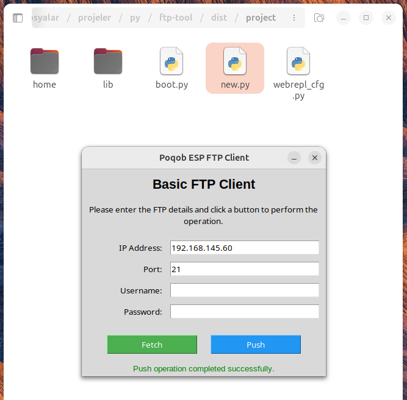
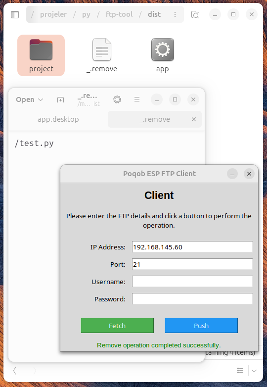

# Project Management Platform for ESP Devices

This project aims to create a project management platform for ESP devices. Users can transfer files via FTP, easily manage their projects, and accelerate their development processes with the tools provided by the platform.

## Features
- **FTP Client**: Perform `fetch` and `push` operations to send files to or retrieve files from ESP devices.
- **Graphical Interface**: Easily perform FTP operations with a user-friendly interface.
- **Command Line Tool**: Quick and flexible usage via CLI.
- **Cross-Platform Support**: Designed to work on both Windows and Linux-based systems.
- **Code Verification**: Automatic Python syntax checking before pushing files to prevent broken code.
- **Selective Transfer**: Use the `.ignore` file to exclude specific files and directories from being pushed.
- **Remote File Cleanup**: Utilize the `.remove` file to specify files that should be deleted from the ESP device after pushing.
- **Auto ESP Restart**: Automatically restart the ESP device after push operations to apply changes immediately.


---

## Installation

### 1. Installing Required Dependencies
The project requires `lftp` and Python dependencies. Follow the steps below to install the dependencies:

#### For Linux:
1. Install the dependencies.
    ```bash
    chmod +x ./scripts/install-dependencies.sh
    ./scripts/install-dependencies.sh
    ```
2. Create python enviroment. (OPTIONAL STEP) - (GUI)
    ```bash
    pip3 install venv
    python3 -m venv venv
    source venv/bin/activate
    ```

3. Build the application with pyinstaller. (OPTIONAL STEP) - (GUI)
   ```bash
    ./build-app.sh
    ```

#### For Windows:
1. Install Chocolatey: [Chocolatey Installation Instructions](https://chocolatey.org/install)
2. Install `lftp` by running the following command:
   ```powershell
   choco install -y lftp
   ```
3. Install Python dependencies: (OPTIONAL STEP) - (GUI)
   ```powershell
   pip install -r requirements.txt
   ```
4. To build the application: (OPTIONAL STEP) - (GUI)
   ```powershell
   ./build-app.sh
   ```

---

### 2. Running the Application

#### Running the Compiled Application
If you have compiled the application, you can run it using the following commands:
- Linux:
   ```bash
   ./dist/app
   ```
- Windows:
   ```powershell
   .\dist\app.exe
   ```

#### Running Python Files Directly
You can run the Python files directly without compiling the application:

- **For the Graphical Interface**:
   ```bash
   python app.py
   ```

- **For the Command Line Tool**:
   ```bash
   python app-cli.py
   ```

This method is especially useful during development or when you want to quickly test the application.

---

### 3. File Transfer and `project` Directory Usage

The application uses a directory named `project` for file transfer operations. This directory is automatically created under the directory where the application is executed and works as follows:

- **Fetching Files**: Files retrieved from the ESP device are downloaded into the `project` directory.
- **Pushing Files**: Changes made in the `project` directory are uploaded to the ESP device.

#### Usage Examples:

1. **Fetching Files**:
   - Command:
     ```bash
     python app-cli.py fetch --ip <ip> [--port PORT] [--username USERNAME] [--password PASSWORD]
     ```
   - Description: This command downloads files from the ESP device into the `project` directory.

2. **Pushing Files**:
   - Command:
     ```bash
     python app-cli.py push --ip <ip> [--port PORT] [--username USERNAME] [--password PASSWORD]
     ```
   - Description: This command uploads changes made in the `project` directory to the ESP device.

### File Removal Mechanism with `_.remove`

In addition to pushing and fetching files, the application supports a file removal mechanism using a special file named `_.remove`:

- **Purpose**: The `_.remove` file allows you to specify files on the ESP device that should be deleted during the next operation.
- **Usage**: Create or edit the `_.remove` file in the root directory of the application, adding one file path per line that you want to delete from the ESP device.
- **Operation**: When you run a push operation or explicitly trigger the remove function, the application reads the `_.remove` file and sends deletion commands to the ESP device for each listed file.

#### Example:
1. Create a file named `_.remove` with the following content:
2. Add a file path to remove line per line.
   ```bash
   home/connection/new.conf
   example.py
   ```

### Graphical User Interface

The application also provides a graphical interface for easier interaction. Below are examples of the FTP operations in the GUI:

#### Fetch Operation
  
*Figure 1: Fetching files from an ESP device using the GUI*

#### Push Operation
  
*Figure 2: Pushing files to an ESP device using the GUI*

#### Remove Operation
  
*Figure 3: Removing files from an ESP device using the _.remove file*

The remove operation is triggered automatically after a push operation. As shown in Figure 3, when the application finds a _.remove file with valid file paths, it will send commands to delete those files from the ESP device. The status of the removal operation is displayed in the result area.

#### Important Notes:
- Files in the `project` directory are used by the application for synchronization. Therefore, be cautious when editing files in this directory.
- If any errors occur during file transfer, the application will provide a detailed error message.
- The _.remove file should be placed in the root directory of the application, not in the project folder.
- After successful removal, you may want to update or clear the _.remove file to prevent accidentally deleting the same files again.

---
`````

